#  Cities Skylines Assetsのパフォーマンスと最適化に関するヒントとテクニック

[](http://comradeintense.github.io/assetoptimization/)<br>

#### ENG version

## Intro
```このウェブサイトは、Deepl Translatorを使用して英語から翻訳されています。読みやすく、理解できるかどうかはわかりません。翻訳にご協力いただける方は、ご連絡ください。```
<br><br>
はじめまして。私は「**ComradeIntense**」です。今回は、**Cities Skylines**のアセットをパフォーマンス面でより良く最適化する方法について、いくつかのヒントとトリックをご紹介します。 
<br>
この先は、私がこの旅で独学で学んだこと、または他の人（主に私の先生 - **Ronyx69**）や仕事場で教えてもらったことであり、私はただ他の人にも知識を伝えたいと思うだけです。このガイドに同意できないことがあれば、遠慮なくご連絡いただき、訂正してください。 
<br>
この小さなガイドは、あなたがすでにアセットを作る方法を知っていることを前提にしています（良いリソースはRonyxのウェブサイトです）。[http://cslmodding.info](https://cslmodding.info)) が、あなたがここにいるのは、**あなたの決定が他の人のゲームのパフォーマンスにどのように影響し、それについて何ができるのか**を知りたいからです。 
<br>
できるだけ短く、要点を絞って書きますが、あちこちでオタク的な部分があり、それはあなたにとって重要なことなので、じっくりと読み飛ばさないようにしましょう。 
<br>
始めましょう。 

## Part I

### 1) ドローコールとは何ですか？

簡単に言うと、ドローコールとは、CPUがGPUに指示する命令のことです。メッシュをロードすると、CPU はメッシュの **各頂点** のワールド空間での位置とマテリアルを計算し、その後 GPU に指示します。 
<br>
```「GPU、ワールドの位置 (x,y,z) には頂点があり、こことこことここにも頂点があり、それらすべての頂点がこのメッシュ全体を構成しているんだ。これらの頂点の間に、UVマップや法線マップなどのこの位置にこのマテリアルを適用して...画面に描画する必要があるんだ！」。```  
 _CPUとGPUの議論（これは当然ながら非常に簡単な説明です。）_.  
<br>
当然ながら、**計算が必要な頂点が多いほど、あるいは多くのメッシュから描画を呼び出すほど＝処理時間が長くなる**のは理にかなっています。  
<br>
問題は、ボトルネックがある場合に発生します。例えば、あなたは非常に強力なGPUを持っていますが、CPUはゴミのようなものです。都市をロードし、そのシーンには建物、プロップ、CIM、車両などからなる 8738423 個のメッシュ（ランダムな数字）があります。 
<br>
CPUは、1つのメッシュごとにそのすべてを計算し（マテリアルごとにドローコールも）、画面に何をレンダリングするかという指示をGPUに与えなければなりません。ボトルネックは、GPU は問題なくこれらすべてを処理できるのに、CPU が遅れ始め、その結果、GPU が何もしないアイドル時間が発生することです
<br>
それを表現するのに適した画像がこちらです。

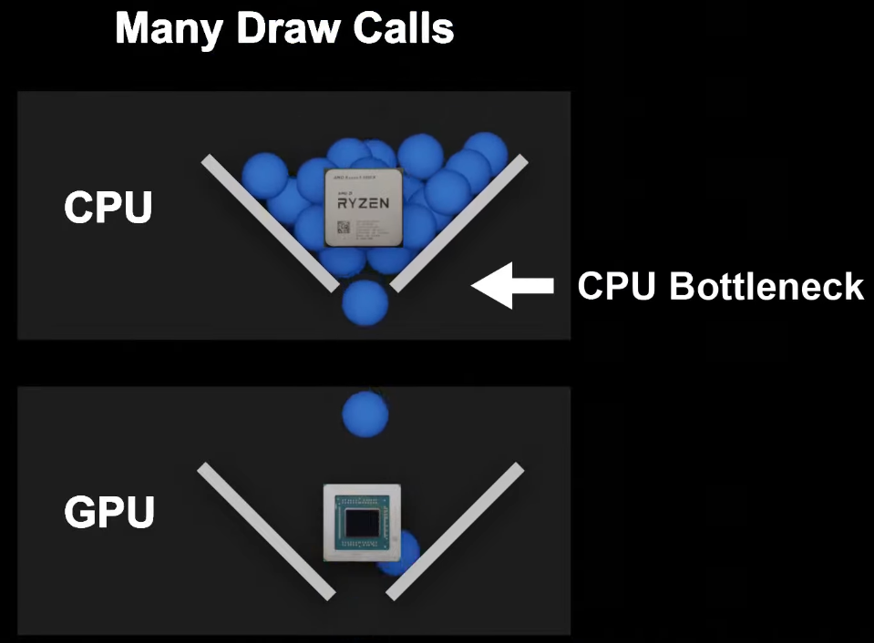

これを見れば、なぜゲームが10fpsで動作しているのか、もうおわかりでしょう。画面上にはたくさんのメッシュがあり、それぞれのメッシュは独自のマテリアルを持ち、CPUはそのすべてを常に計算し、すべての情報をGPUに送ってレンダリングしなければならないのです。そう考えると、私たちがこのゲームをプレイできるのはとても不思議なことで、今のCPUとGPUの力強さは本当に驚異的です。

### 2) 三角形（Tris）の数は重要か？

ドローコールが何であるかを理解したところで、大きなトピックである三角形の数について説明しましょう。最初に理解しておくべきことは、**頂点**は三角形よりも重要であり、それらは計算されるものだからです。しかし、3つの頂点は三角形を形成するので、議論から三角形を「無視」することはできません。
<br><br>
**資産をモデル化するときは、いつもこれを念頭に置いてください：**。<br><br>
三角形の数が減る＝性能が上がる<br>
三角形の数が少ない＝GPUが計算する必要がある頂点の数が少ない<br>
頂点の計算・処理には **コストがかかる** 。<br>
<br>
現実的に言えば、最近のGPUは何千ものトライアングルのシーンを多くの問題なくレンダリングできます（次のトピックで少し説明します）。しかし、だからといって、すべてを、細かいところまでモデリングする口実を与えるべきではありません。
<br><br>
**Ronyx69**はよく言ってくれました。 _“あなたのアセットが5kトリスだろうが25kトリスだろうが、**単体では**関係なく、他のすべてのアセットと一緒になって大海の一滴となるのです。画面上には何百ものアセットがあるので、各アセットに1kトリスがあるかないかで、その差は歴然です。”._

### 3) Cities Skylinesと他のゲームとの違い

他のゲームでは、開発者はパフォーマンスを上げるためにさまざまな工夫をしています。例えば、CPU/GPUにとって、どちらがレンダリングしやすいと思いますか？100.000 個の三角形を持つ 1 つのメッシュ、またはそれぞれ 1000 個の三角形を持つ 100 個のメッシュ？答えは、メッシュの描画呼び出しが1回、マテリアルの描画呼び出しが1回なので、1つのメッシュです**。多くの小さな「ハック」の中で、ゲーム開発者は複数のメッシュを1つにまとめています。
<br><br>
また、他のゲームでは、開発者がシーンを最適化するために、プレイヤーやカメラに近いメッシュにはより多くのトライアングル数を使用しますが、背景にあるメッシュにはほとんどトライアングルを使用せず、時には平面上のディテールをベイクすることさえあります。
<br><br>
I都市スカイライン**は、ワイルド・ウェストなので、そのような贅沢はできません。プレイヤーは多くの建物、プロップ、植生などをサブスクライブして、マップ上の好きな場所に配置しますが、制限がないため、かなり非最適化されたシーンが作成されます。これらのメッシュのそれぞれについて、**CPUは高価な描画コールを行わなければならない**ことを理解してください。
<br><br>
ですから、三角形や頂点数を意識することは重要ですが、それにこだわってはいけないと思います。モデリングしなければならないものと、ノーマルマップやディフューズでごまかせるものとの適切なバランスを見つけ、なるべく少ないほうにするようにしましょう。

## Part II

### 5) バーテックス精密損失

ゲームでは、x,y,z = 0,0,0という世界の原点が存在します。そこから、メッシュを構成するすべての頂点は、世界原点を基準に計算されます。ゲーム開発者は、カメラに対する頂点の位置を計算することもあれば、世界原点を移動させることもあります。Cities Skylinesがどのように行っているかは全く分かりませんが（おそらくマップの中心は（0,0,0））、それは関係ありませんので、ご容赦ください。

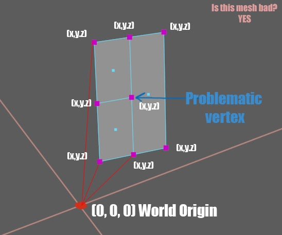

Part I**で、メッシュの描画を呼び出すと、各頂点がワールド空間、つまり0,0,0（ワールド原点）を基準にした空間上の位置に計算され、それがGPUに送られて画面上に描画されるとお話しましたね。
<br><br>
各頂点の位置に関する情報はすべて32bitのfloatコンテナに格納され、それを「**浮動小数点**」と呼びます。(怖がらないでください。オタク的な話はこれだけです)。浮動小数点の考え方は、**ある点までしか正確でない**ということです。
<br><br>
頂点が世界の原点（0,0,0）から離れて計算する必要があるほど、CPUは正確な頂点位置**を計算できないので、メッシュはエラーになりやすく、頂点は精度が落ち始めますが、切断された頂点は目に見える問題が発生します。
<br><br>
この場合、メッシュの真ん中にある頂点は、**何にもつながっていません**。CPUはその正確な位置を計算しようとし続けますが、しばらくすると精度が落ち始めます。このような場合（大げさな例ですが）には、次のようになります。

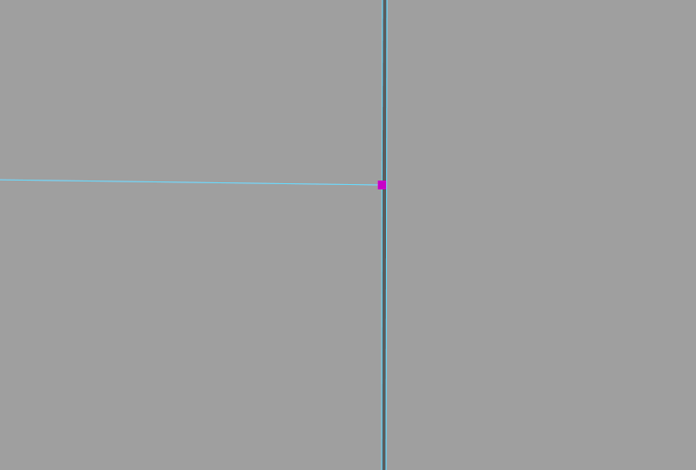

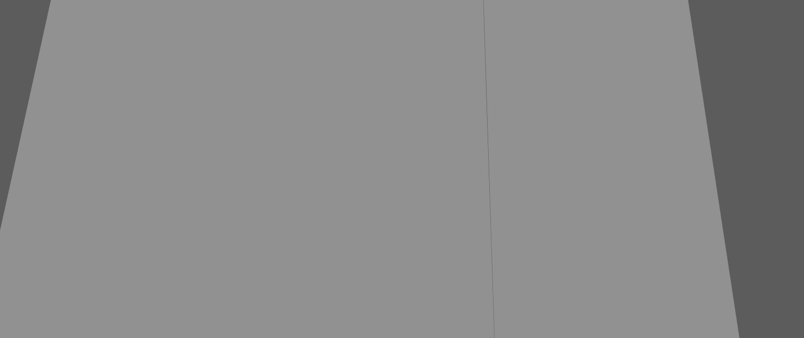

頂点は他の何にも接続されていないので、メッシュに穴を開け始め、それがさまざまなシェーディングの問題、光が差し込む穴、悪いアーティファクト、その他あらゆる種類の奇妙な不具合に変化します。
<br><br>
** では、これを解決するにはどうしたらよいのでしょうか？**
いわばメッシュが「閉じている」状態である必要があります。この場合、その頂点はどこかでつながっているはずで、例えば次のようになります。

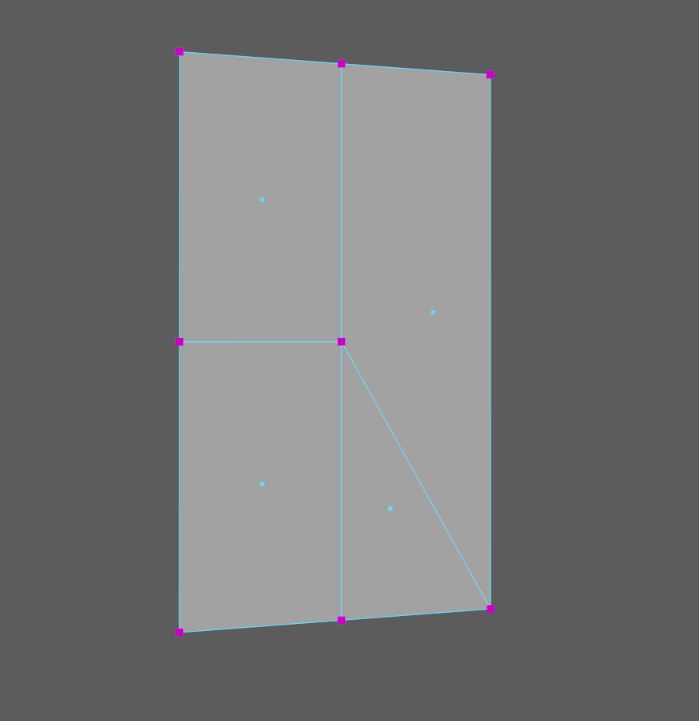

精度が落ちたとしても、メッシュはまだつながっていますし、最悪の場合、頂点の位置がほんの少しずれるだけで、**目に見える**エラーはまったく発生しません。
<br><br>
しかし、どうしても頂点をつなげることができない場合は、このように隣の面と頂点を少し重ね合わせればよいのです。

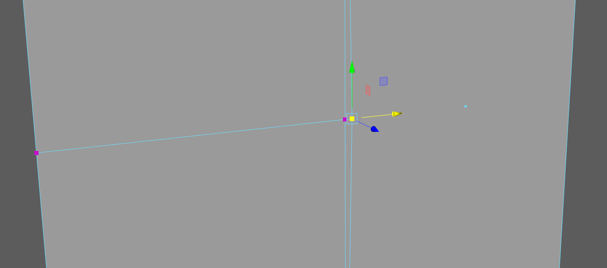

(大げさな例ですが、頂点を右に移動して、隣の面と重なるようにしました）。これは理想的な解決策ではなく、同じテクスチャがある場合にのみ行うべきで、重なった面がZファイトして厄介なフリッカーが発生することはありません。
<br><br>
ですから、三角形の数が増えても、頂点はつないでおいたほうがいいんです。また、頂点の結合は必ず行ってください。
<br><br>
このアイデアをさらに脳に叩き込むためのボーナスとして、このビデオをご覧ください。 [https://youtu.be/Xfh3oTIqJW8?t=305](https://youtu.be/Xfh3oTIqJW8?t=305) マインクラフト**というゲームから、古いバージョンだったころに その人は、世界の原点からどんどん遠くにテレポートしたらどうなるかをテストしていました。**
B彼は世界の原点から非常に遠くにいたため、ブロックが正しくレンダリングされなくなり（CPUはブロックを構成する4つの頂点それぞれの正確な位置を把握するのに苦労していた）、それがどれほど悪化したかがよくわかるでしょう。Minecraft がどのようにこれを修正したのか、正確な解決策はわかりませんが、おそらく世界の原点が常にシフトしているのでしょう (私の推測です)。

### 6) オーバードロー

ゲームにおける過描画は、一般にサイレントキラーと呼ばれ、最適化されないとすぐにゲームのパフォーマンスを台無しにしてしまいます。では、それは何なのでしょうか？
<br><br>
簡単に言うと、オーバードローとは、GPUが重なり合ったピクセルを描画することで、**時間、メモリ、パフォーマンスを消費する**ことです。GPUの目的は、あなたが見ているシーンをレンダリングし、その画像をスクリーンに映し出すことです。しかも高速に
<br><br>
技術的なことには触れないと約束しましたが（Overdrawは理解するのがかなり面白いのに）、理解を深めるために極めて単純化したものをお見せします。
<br><br>
その好例がこちら。

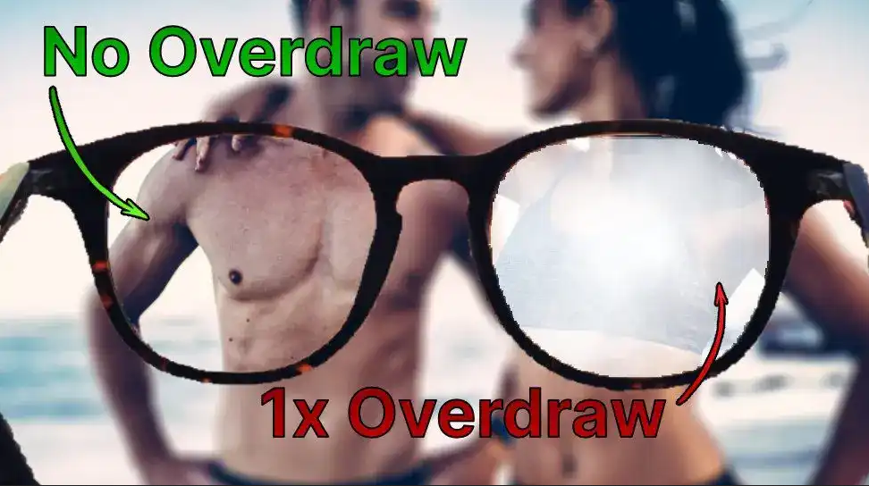

この画像（3Dレンダリングシーンを想像してください）では、CPUは環境（奥のカップル）に対してドローコールを行い、メガネに対してドローコールを行うでしょう。その後、GPUは画面上のピクセルをレンダリングしなければなりませんが、そのためには、カップルとメガネレンズ（メガネの右レンズ上の重複ピクセル）の両方をレンダリングするのに多くの時間がかかるでしょう。
<br><br>
**オーバードローはどうすればいいんだ**
<br><br>
このようなシナリオがあるとします。この建物は2つの「シェイプ」でできていて、高い方のシェイプと、メインの高い方のシェイプを貫く長い方のシェイプがあります。多くの切断を避け、三角形を節約するために、メインの建物をこのように通過させることにします。

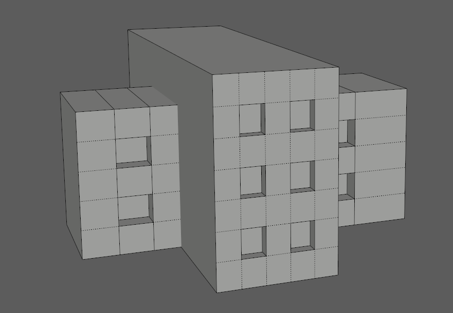

下から見たところ。

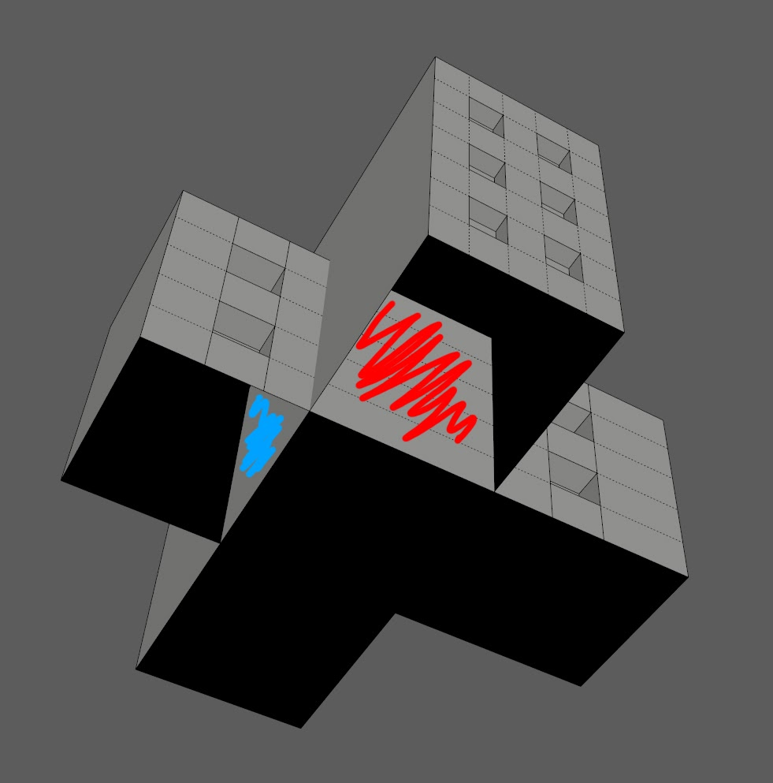

この場合、両方の建物の赤と青の部分がOVERDRAWNになっており、**OVERDRAWNのため切り取る必要があります**。基本的に、GPU は、高いビルから赤、メインビルから青でマークされたこれらのピクセル（決して見ることはできません）をレンダリングする必要があります。
<br><br>
このように、カメラに映らない部分を大きくカットして、GPUが必要以上に働かないようにすることで、オーバードローを防ぐことができるのです。

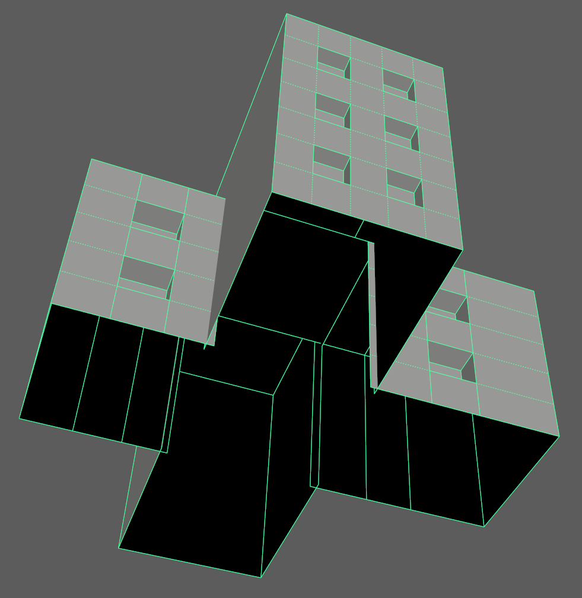

理解を深めるための分解図。

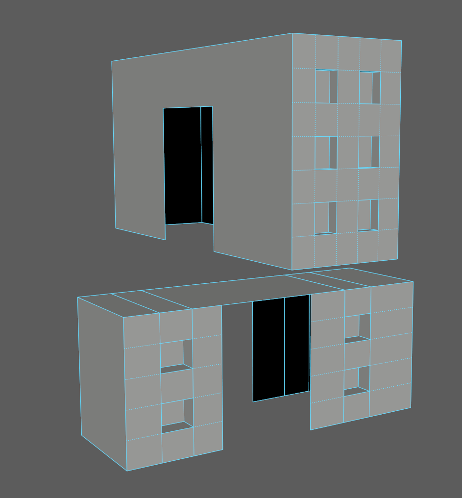

_(これはあくまでオーバードローを説明するための具体的な例です。メッシュは適切に三角形化されておらず、多くのNgonがあります)_

主な収穫 **カメラに見えない画素をGPUにレンダリングさせない！**。
<br><br>
もう一つ、オーバードローを説明する例を挙げます。この剣の画像を持っていて、それをゲームに追加するとします。

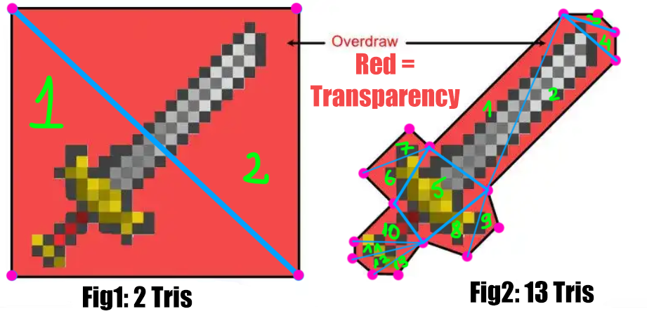

**何がいいんだろう？**
2つの三角形しかない**Fig1**と、13の三角形がある**Fig2**のどちらを選ぶか？画像では、赤い部分がアルファで、透明になっています。
<br><br>
ここまでの内容を理解すれば、明確な答えは図2です。三角形が増えることは問題ではありません。しかし、絶対に必要なのは、過剰描画を減らすことです。赤い部分の画素は透明ですが、いわば「そこにある」のです。CPU はそのシェイプの描画コールを行い、GPU はそれらを計算し ますが、それは見えなくなるだけです。時間とメモリ帯域の無駄です。
<br><br>
_この最後の画像は、オーバードローをよりよく説明するための一例であることに注意してください。Cities Skylinesのアルファを含む非常に小さな顔には、このような処理を行うべきではありません。._

(**訂正**：図2の5番を三角測量するのを忘れていたので、本当は15番なのです。)

### 7) オーバーシェード

Overdrawの近縁種に**オーバーシェーディング**があり、これもパフォーマンスの原因となっています。オーバーシェーディングの原因は薄い三角形で、これはできるだけ避けるべきです。なぜなら、**GPUは2x2パターンに配置された4つのピクセルのブロック単位でピクセルを処理するからです**。そのため、三角形が 2x2 の四角形の 1 ピクセルにほんの少し触れただけで、GPU は四角形全体を処理し、残りの 3 ピクセルを捨ててしまうので、**75% 無駄な作業となります**。これを何度も繰り返すと、あっという間に積み重なります。
<br><br>
以下、解説します。

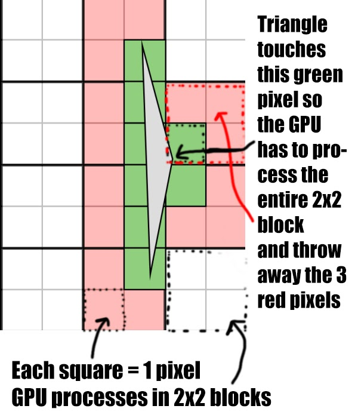

以前、私が手がけた建物で、このようなジレンマに陥ったことがあります。三角形を節約したかったので、上下（一番右側の面）の頂点をすべてマージしました。技術的には、インゲームでは何の問題もないでしょう。しかし、いくつかのカットを追加することで簡略化できるものに対して、GPUに負担を強いているのです。確かに、コストはより多くの三角形になりますが、すでに説明したように、GPUが置かなければならない無駄な仕事に比べれば、それほど重要ではありません。
<br><br>
これが建物で、これをきれいにするために私はこの解決策を思いつきました。すべてがきちんと接続されています（前と後）。

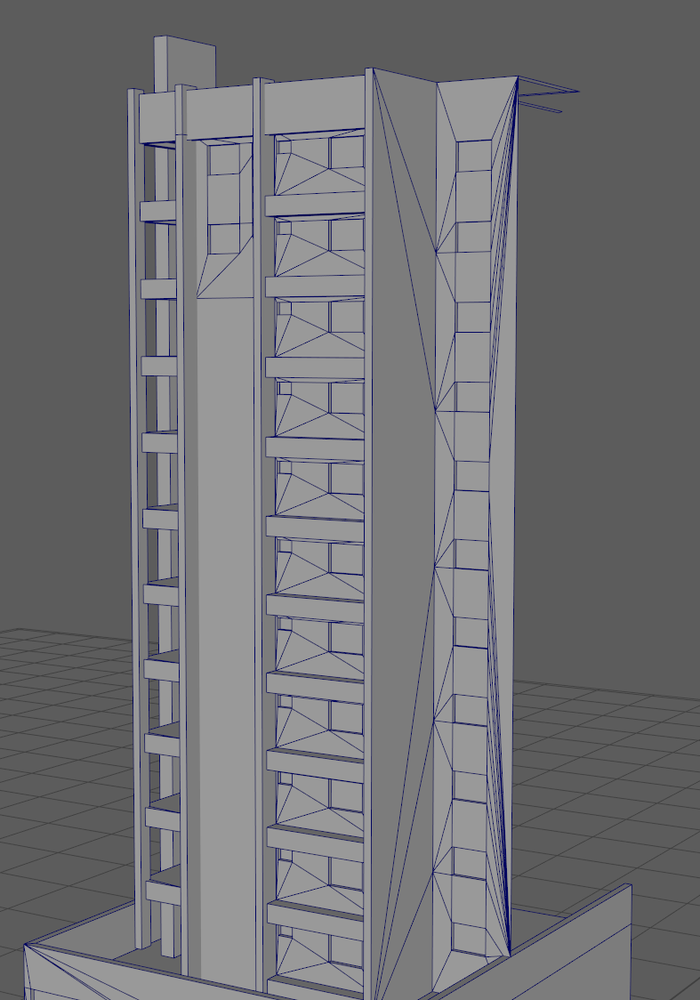

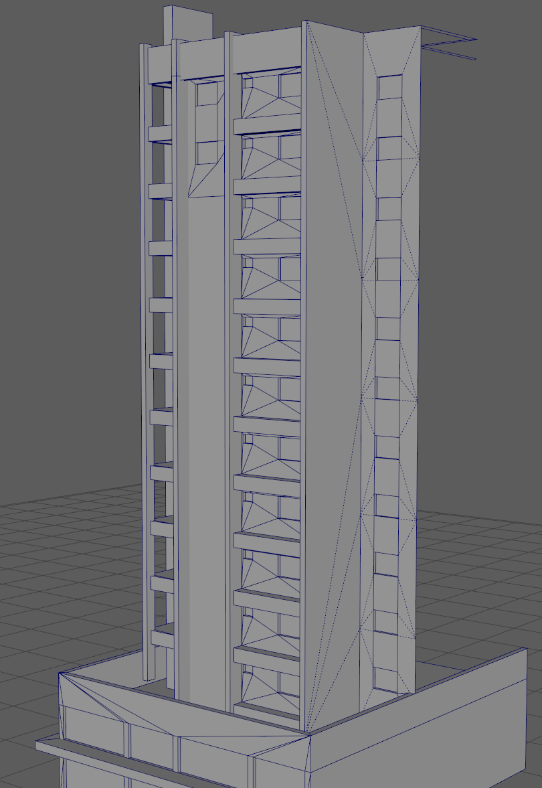

最近のGPUはこの計算がめちゃくちゃ速いという議論もありますが、私はそれは**掃き溜め**だと考えています。より良いトポロジーを考え出し、この問題を解決するには、文字通り数分しかかかりませんので、できるだけメッシュに細長い三角形がないようにしましょう。

## Part III

### 8) テクスチャーの2のべき乗

テクスチャに2のべき乗を使用することについては、常にいくつかの議論がありました。テクスチャはどんな比率でもよく、正方形である必要はありません。たとえば、256x2048はまったく問題ありません。
<br><br>
決してやってはいけないことは、2のべき乗ではないテクスチャを使用することです。
<br><br>
と言われるかもしれません。"**しかし、私はそれで問題を起こしたことはありません**"
<br><br>
重要なことは2つあります。<br>
**A) 圧縮**<br>
テクスチャファイルを保存し、アセットエディタを起動すると、ゲームエンジンはテクスチャを圧縮テクスチャフォーマットであるDXTフォーマットに変換します（DXTは圧縮アルゴリズムです）。テクスチャが32で割り切れないと圧縮されないので、上記の数字に注意してください。
<br><br>
**B) MipMaps**<br>
テクスチャを読み込むと、ゲームエンジンはそのテクスチャに対してミップマップを生成します。ミップマップはまさにテクスチャのLODで、元のテクスチャのコピーを低解像度で保存したものです。メッシュがカメラから離れると、低解像度のテクスチャが適用され、カメラを遠ざけるほど縮小され続けます。逆に、カメラを近づけると、テクスチャのサイズは大きくなり、元のサイズになります。
<br><br>
ここでは、ミップマップチェーンの例を示します。

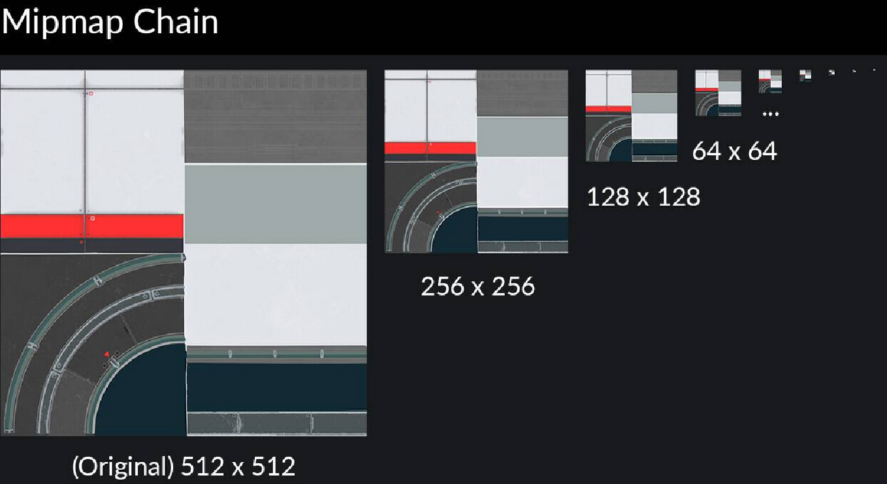

これはゲームエンジンが自動的に行うことで、あなたは何もする必要がありません。
<br><br>
**では、2の累乗とどのような関係があるのでしょうか。**
さて、ここからが本題です。2のべき乗のテクスチャを使用しない場合、圧縮によってテクスチャが破損し、長い距離や斜めからメッシュを見たときにそれが見えることがあります。テクスチャはまだ機能し、モデル上で見ることができますが、その背後には問題があります。
<br><br>
もうひとつ、ゲームエンジンによっては、たとえばUnreal Engineの場合、2のべき乗のテクスチャを使わないとミップマッピングが発生しないこともあるんです。Unityエンジン（*Cities Skylines**が使用しているエンジン）には、別の回避策があります。
<br><br>
このエンジンでは、2のべき乗でないテクスチャを使用できますが、その場合、メモリがより多く消費され、GPUによる読み込みがより遅くなります**。

### 9) テクスチャサイズ

このガイドの最後に、テクスチャサイズについて説明します。これも他の項目と同様に、パフォーマンスを大きく左右します。画像の解像度サイズが大きければ大きいほど、それを画面にレンダリングしようとするときに、より多くのメモリ（GPUのVRAM）を使用します。
<br><br>
**まず、いくつかのことを説明させてください。**
テクスチャをPNGでハードディスクに保存する場合、そのサイズはキロバイトでもメガバイトでも問題ありません。
<br><br>
また、メモリ使用量はテクスチャの複雑さ、細かさには依存しないこともポイントです。
<br><br>
**重要なのは解像度のサイズだけなので、きれいなディテールを保ちつつ、できるだけ小さくするように努力すべきです。**
<br>
前章で説明したように、**Cities Skylines**では、DXTは以下のようにテクスチャを圧縮して効率的に保存します。<br>
_diffuse<br>
_alpha + _color + _illumination together (ACI)<br>
_normal + _specular together (XYS)<br>
<br>
Ronyx69**が作成した、圧縮されたテクスチャのサイズを確認するための良いチャートを見ることができます。:

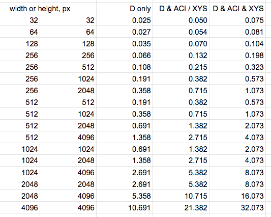

_above chart is in MB_
<br><br>
アセット上の最終的なサイズは、テクスチャだけで100％決まるわけではありませんが、通常はそれらが大部分を占めていることを念頭に置いてください。
<br><br>
**さて、それでどうする？**
さて、もうお分かりかと思いますが、三角形のカウントと同じで、必要以上にテクスチャサイズを大きくしないことです。簡単でしょう？これが最大の問題で、これを適切に行うにはある程度の経験が必要です。私もアセット制作を始めたばかりの頃はゴミ同然で、今では半分以下のサイズで作れるテクスチャを巨大なサイズにしてしまったりと、ひどい失敗をしたものです。
<br><br>
問題は、アセット制作に慣れるまでの過程と、正しい「方向性」の経験不足にあります。ここが嫌われるところですが、これが現実なのです。多くのアセットクリエイターは、作りたい建物（またはその一部）の良い写真を見つけ、それをblenderにインポートし、その上に面を押し出すだけです。そして、そのやり方を他のクリエイターに教え、悪いサイクルが繰り返される。
<br><br>
でも、それのどこが悪いのか、と思われるかもしれません。なぜなら、テクスチャのどの部分を再利用するか、どの部分をタイル化するかなどを考える代わりに、テクスチャの大きなサイズをカバーする大きな面を持つことが好まれ、その結果、解像度サイズがずっと小さくなってしまうからです。ここでは、パフォーマンスに影響する事柄に焦点を当てたいと思います。
<br><br>
ほとんどのアセットでは、2048以上の解像度のテクスチャは必要ありませんし、すべてをモデル化する必要はありません。

### Outro

Cities Skylines」のアセットを行う際には、これらのヒントやコツを武器にすることを心から願っています。
<br><br>
当初は、性能的に重要な順番を考えていたのですが、よく考えてみると、どれも同じくらい重要で、**無視できないものです**。
<br><br>
**例えば、こんな感じです。**<br>
テクスチャが無いのに三角形の数が多いメッシュ＝三角形の数が問題ですbr>
100trisメッシュで4k解像度サイズのテクスチャ＝テクスチャサイズが問題になる<br>
低解像度のロートリス・メッシュでありながら、いたるところで面が重なり合っている＝オーバードローが課題<br>
… とうとう<br>
<br>
最後に、このガイドを読み、それを参照し、次のアセットを作成するときに、これらのすべてのことを考えることです。常に進歩し続け、新しいアセットを作るたびに、前のものよりも良くなるはずです。なぜなら、学び続けることで、過去に犯した間違いを知ることができるからです。
<br><br>
これがあなたの役に立つことを願っています。<br>
**Comrade Intense**, peace.
