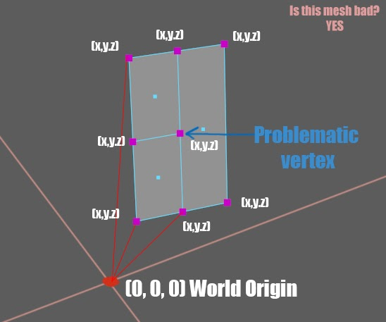
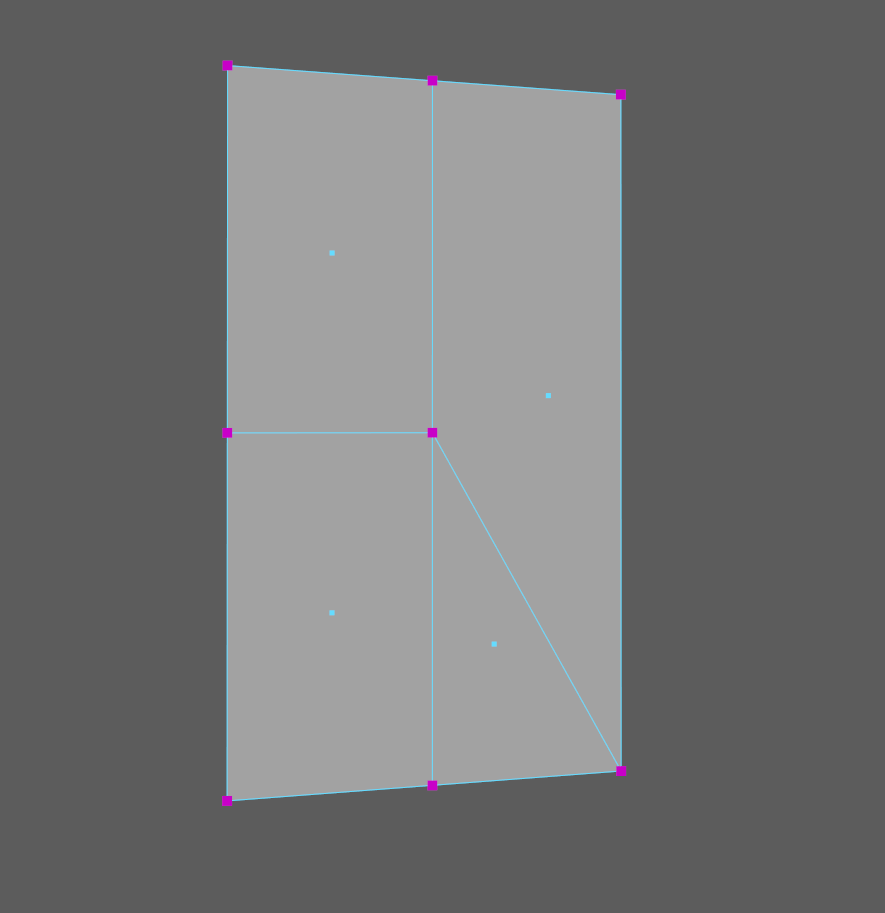
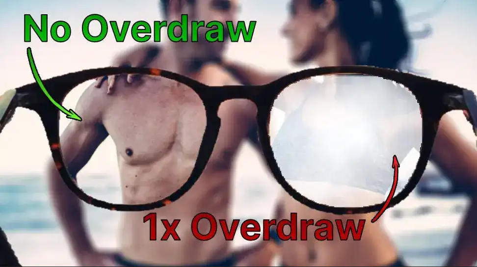
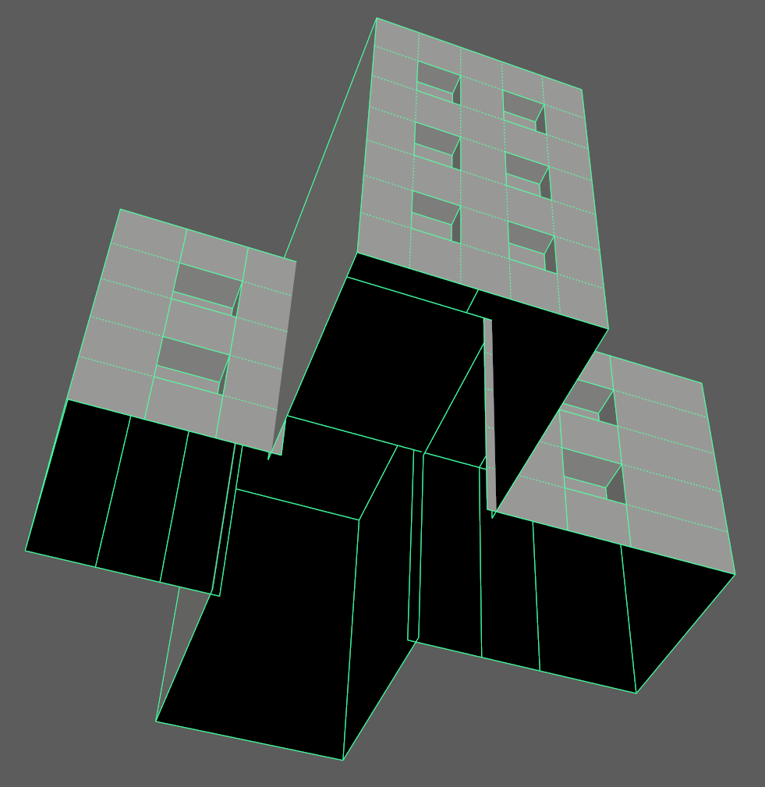
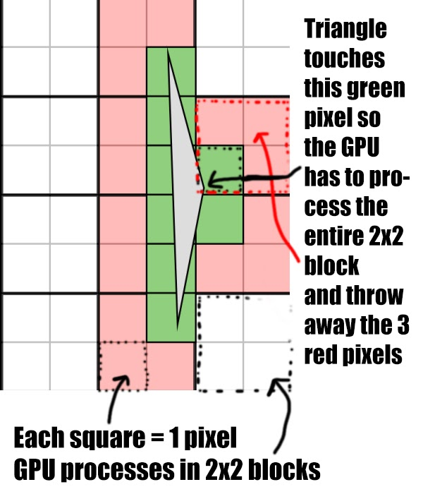
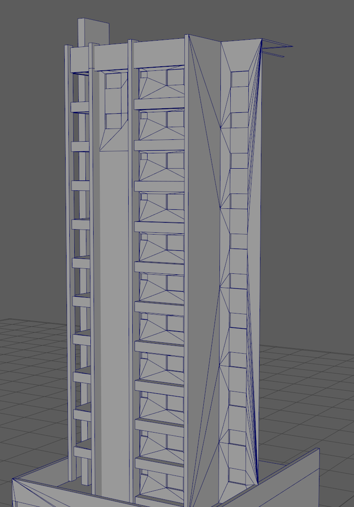
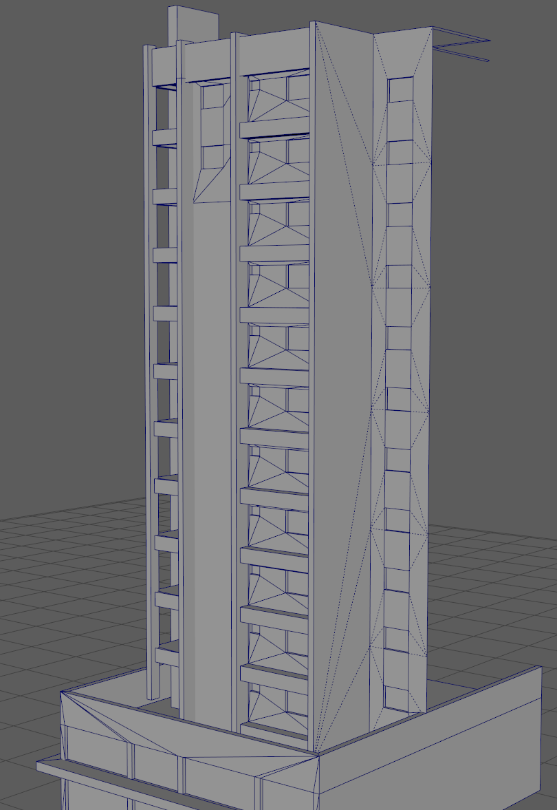
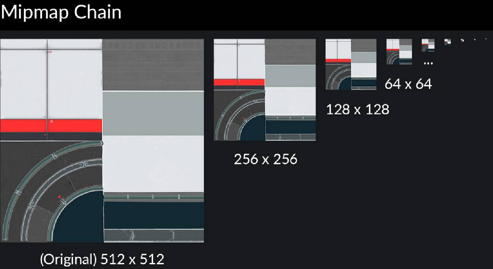

#  시티즈 스카이라인 에셋의 성능과 최적화에 관한 팁과 트릭

## 인트로
반갑습니다! 저는 “**ComradeIntense**”이며 성능 측면에서 당신의 **시티즈 스카이라인**의 에셋을 더 잘 최적화하는 방법에 대한 몇 가지 팁과 트릭을 보여드리기 위해 여기에 있습니다.
<br>
앞으로 여기에서 읽을 내용은 제가 이 여정에서 스스로 배운 내용이거나 다른 사람(대부분 제 멘토 - **Ronyx69**) 또는 직장에서 배운 내용이며, 저 또한 다른 사람에게 지식을 전달하고 싶습니다. 이 가이드에서 동의하지 않는 부분이 있다면 주저하지 말고 저에게 연락해 바로잡아 주세요. 저도 배우고 있습니다.
<br>
이 작은 가이드는 에셋을 만드는 방법을 이미 알고 있다고 가정합니다. (좋은 리소스로 Ronyx의 웹사이트가 있습니다: [http://cslmodding.info](https://cslmodding.info)) 하지만 당신은 **당신의 결정이 다른 사람들의 게임 성능에 어떤 영향을 미치는지 알고, 그것에 대해 무엇을 할 수 있는지**를 아는 것에 관심이 있기 때문에 여기 있을 것입니다.
<br>
저는 가능한 한 짧게 쓰고 중점을 강조하겠지만, 여기저기에 여러분이 이해해야 할 중요한 몇 가지 특이한 부분이 있을 것이므로, 시간을 갖고 어떤 것도 건너뛰지 마세요.
<br>
시작합시다.

## 파트 I

### 1) 드로우 콜이란 무엇입니까?

간단히 말하자면, 드로우 콜은 CPU가 GPU에 수행하도록 지시하는 명령입니다. 여러분이 메시를 로드할 때, CPU는 월드 공간 및 머티리얼에서 메시의 **각 버텍스**의 위치를 계산한 후 GPU에 다음과 같이 말합니다:  
<br>
```"이봐, 전능하신 1050 GPU, 월드의 (x,y,z) 위치에 버텍스가 있고, 여기에도 있고 또 여기에 있고, 그리고 이 모든 버텍스가 이 전체 메시를 만들어. 이러한 버텍스들 사이에 UV맵의 이 위치에 이 머티리얼을 적용해야 해. 그리고 노멀 맵 등등 또한... 그리고 화면에 그려야 해!"```  
 _CPU와 GPU 간의 대화(분명히 이건 매우 단순한 설명입니다)_.  
<br>
자연스럽게, **계산해야 하는 버텍스가 많거나 많은 메시에서 드로우 콜이 많아질수록 = 더 긴 처리 시간**이 됩니다.
<br>
병목 현상이 생기면 문제가 발생하기 시작합니다. 예를 들어, 당신이 매우 강력한 GPU를 가지고 있지만 CPU는 쓰레기인 경우. 도시를 불러오고 나면 해당 장면에는 건물, 프롭, cim들, 차량 등등을 구성하는 8738423개의 (내 엉덩이에서 가져온 랜덤 수입니다) 메시가 있습니다.
<br>
CPU는 각 단일 메시(및 각 머티리얼에 대한 드로우 콜)에 대한 모든 것을 계산하고 화면에 무엇을 렌더할 것인지에 대한 명령을 GPU에 제공해야 합니다. 병목 현상은 GPU가 문제 없이 이 모든 것을 처리할 수 있지만 CPU가 렉걸리며 뒤처지기 시작하여 GPU가 할 것이 아무것도 없는 유휴 시간이 생겨난다는 점에서 발생합니다.
<br>
이것을 잘 묘사하는 이미지입니다:


이것을 바탕으로 당신은 게임이 10fps로 돌아가는 이유를 어느 정도 이해할 수 있습니다 ㅋㅋ. 화면에는 많은 메시가 있고 각 메시에는 그 메시가 가진 머티리얼이 있으며 CPU는 지속적으로 그것들의 모든 정보를 계산하고 모든 정보를 GPU로 보내 렌더링해야 합니다. 이 점에 대해 생각해보면 우리가 이 게임을 할 수 있다는 것은 정말 마법 같은 일이고, 오늘날의 CPU와 GPU의 강력한 힘은 완전히 미쳤습니다.

### 2) X개의 삼각형(Tris)는 문제가 되나요?

드로우 콜이 무엇인지 이해했으므로 이제 큰 주제에 대해 논의해 봅시다: 삼각형의 갯수. 먼저 이해해야 할 것은 **버텍스**가 삼각형보다 더 중요하다는 것입니다. 계산되는 것이 그것들이기 때문입니다. 하지만, 3개의 버텍스가 하나의 삼각형을 형성하기 때문에 논의에서 삼각형을 “무시”할 수는 없습니다.
<br><br>
**에셋을 모델링할 때마다 다음을 항상 생각하세요:**<br><br>
적은 수의 삼각형 = 성능 향상<br>
적은 수의 삼각형 = GPU가 계산해야 하는 버텍스 수가 적음<br>
버텍스를 계산/처리하는 것은 **비쌉니다**.<br>
<br><br>
현실적으로 말하자면, 현대의 GPU는 많은 문제 없이 수천 개의 삼각형이 있는 장면을 렌더링할 수 있습니다 (다음 주제에서 약간 설명합니다), 그러나 이것이 모든 작은 하나의 디테일을 전부 모델링할 변명을 주어서는 안 됩니다. 왜냐하면 큰 그림을 보세요: 만약 모든 사람이 이를 무시한다면, 성능 저하가 상당히 크게 될 것입니다. 따라서 무언가를 모델링할 때마다 tris 수를 적게 유지하고 **필요한 것보다 더 많은 삼각형을 사용하지 마세요**.
<br><br>
**Ronyx69**의 좋은 말: _“당신의 에셋의 tris가 5000개인지 25000개인지는 중요하지 않습니다, -**그 자체만 고립된 경우**-, 하지만 당신은 모든 다른 에셋들과 함께 바다의 한 방울입니다. 화면에는 수백 개의 에셋이 있기 때문에 각 에셋에서 '여기에, 저기에 1000 tris 더' 하면 차이를 만들 것입니다.”_

### 3) 시티즈 스카이라인과 다른 게임의 차이점

다른 게임에서 개발자는 성능을 향상시키기 위해 다양한 트릭을 사용합니다. 예를 들어, CPU/GPU가 렌더링하기에 무엇이 더 쉽다고 생각하십니까? 10만 개의 삼각형이 있는 1개의 단일 메시일까요?, 아니면 각각 1000개의 삼각형이 있는 100개의 메시일까요? 답은 **메시에 한 번, 머티리얼에 한 번 드로우 콜**을 수행하기 때문에 1개의 단일 메시입니다. 많고 사소한 '꼼수' 중에, 게임 개발자가 여러 메시를 1개로 결합하는 것이 있습니다.
<br><br>
또한 다른 게임에서 개발자는 플레이어/카메라에 가까운 메시에는 더 많은 수의 tris를 사용하고 배경에 있는 메시에는 삼각형을 거의 사용하지 않거나 때로는 심지어 평평한 표면에 세부사항을 베이크하여 장면을 최적화합니다.
<br><br>
황량한 서부인 **시티즈 스카이라인**에서는 우리에게 그런 사치가 없습니다. 플레이어는 많은 건물, 프롭, 식물 등을 구독하며 맵에서 원하는 곳에 배치하고 제한이 없기 때문에 상당히 최적화되지 않은 장면을 만듭니다. 모든 각 메시에 대해 **CPU는 비싼 드로우 콜을 해야 한다는 것**을 이해해야 합니다.
<br><br>
따라서 삼각형/버텍스 수에 대해 **생각**하는 것은 중요하지만 저는 그것에 집착해서는 안 된다고 말하고 싶습니다. 모델링해야 하는 것과 노멀 맵으로 속일 수 있는 것 또는 디퓨즈 맵 사이의 적절한 균형을 찾고 적게 할 수 있도록 노력하세요.

## 파트 II

### 5) 버텍스 정밀도 손실

게임에는 x,y,z = 0,0,0인 월드 원점이 있습니다. 여기에서부터, 메시를 형성하는 모든 버텍스는 월드 원점을 기준으로 계산됩니다. 때때로 게임 개발자는 카메라를 기준으로 버텍스의 위치를 ​​계산하거나 때로는 그냥 월드 원점을 이동시킵니다. 저는 시티즈 스카이라인이 어떻게 하는지는 전혀 모르지만(아마도 맵의 중심은 (0,0,0)일 것입니다), 이건 별로 상관이 없습니다. 그냥 잠시 참아주세요.



**파트 I**에서 이야기한 내용은, 메시에 대해 드로우 콜이 만들어 질 때 일어나는 일은 각 버텍스가 0,0,0(월드 원점)을 기준으로 공간에 배치되어, 즉 월드 공간에서 계산되고 GPU로 보내져 화면에 그려진다는 것입니다.
<br><br>
각 버텍스의 위치에 대한 모든 정보는 32비트 부동 소수점 컨테이너에 저장되며 “**부동 소수점**”이라고 합니다. (두려워하지 마세요. 제가 이야기할 유일한 괴상해 보이는 부분입니다). 부동 소수점에 대한 아이디어는 **특정 지점까지만 정확하다는 것**입니다.
<br><br>
버텍스를 월드 원점(0,0,0)에서 더 멀리서 계산해야 할 필요가 있을수록 CPU가 **정확한 버텍스의 위치를 정확하게** 계산할 수 없게 되고 버텍스는 정밀도를 잃기 시작하기 때문에 메시 오류가 발생하게 됩니다. 분리된 버텍스는 시각적 문제를 일으킵니다.
<br><br>
우리의 경우, 메시 중간에 있는 버텍스는 **어떤 것과도 연결되어 있지 않습니다**. CPU는 정확한 위치를 계산하려고 계속 시도하지만 잠시 후 정밀도를 잃기 시작합니다. 이런 일이 발생하면 (과장된 예시입니다) 다음과 같은 걸 볼 수 있습니다:


버텍스가 다른 어떤 것과도 연결되어 있지 않기 때문에 메시에 구멍이 생기기 시작하고 이에 따라 다양한 그림자 문제 / 빛이 찌르는 구멍 / 나쁜 아티팩트 및 기타 모든 종류의 이상한 글리치로 이어집니다.
<br><br>
**그래서 이걸 어떻게 고치나요?**
말하자면 메시는 "닫혀" 있어야 합니다. 우리의 경우, 이 버텍스는 다음과 같이 어딘가에 연결되어야 합니다:



이제 정밀도 손실이 있더라도 메시는 여전히 연결되어 있으며, 최악의 경우 버텍스가 위치를 아주 아주 조금 이동하지만 **보이는** 오류는 전혀 없습니다.
<br><br>
그러나 버텍스를 연결할 수 있는 방법이 없는 경우가 있다면, 다음과 같이 버텍스를 그 옆에 있는 페이스와 약간 겹칠 수 있습니다:


(과장된 예지만 버텍스를 오른쪽으로 이동하여 옆에 있는 페이스와 겹치도록 했습니다.) 이것은 이상적인 해결책은 아니며 겹쳐진 면이 Z-fight를 일으키고 성가신 깜빡임을 유발하지 않도록 텍스처가 동일한 경우에만 이것을 해야 합니다.
<br><br>
따라서 삼각형의 수가 늘어나더라도 버텍스는 연결 상태로 유지해야 합니다. 또한, 버텍스를 병합했는지 확인해야 합니다.
<br><br>
보너스, 이 아이디어를 당신의 뇌 속으로 더 파고드려면 **마인크래프트**가 예전 버전일 때 나온 이 비디오 [https://youtu.be/Xfh3oTIqJW8?t=305](https://youtu.be/Xfh3oTIqJW8?t=305) 를 확인해 보세요. 이 사람은 월드 원점에서 점점 더 멀리 텔레포트하면 어떻게 되는지 테스트하고 있었습니다. 그는 월드 원점에서 매애애애애애우 멀리 떨어져 있었기 때문에 더 이상 블록이 제대로 렌더될 수 없었고 (CPU는 블록을 만드는 4개의 버텍스 각각의 정확한 위치를 파악하는 데 어려움을 겪고 있습니다.) 당신은 그것이 얼마나 나빠지는지 명확하게 볼 수 있습니다. 저는 마인크래프트가 이것을 어떻게 고쳤는지에 대한 정확한 해결책을 알지 못하지만, 아마도 월드 원점이 지속적으로 바뀌도록 했을 것입니다 (저의 추측).

### 6) 오버드로우

게임에서 오버드로우는 일반적으로 조용한 킬러로 여겨지며 최적화되지 않은 경우 게임의 성능을 매우 간단하게 망칠 수 있습니다. 그래서 이게 무엇인가요?
<br><br>
간단히 말해서 오버드로우는 GPU가 겹치는 픽셀을, 다시 말해 **덮어서 - 그리기**로 렌더링해야 하는 경우로, **시간, 메모리 및 성능을 소모합니다**. 강력한 GPU의 목적은 보고 있는 장면을 렌더하고 해당 이미지를 화면에 표시하는 것입니다. 그리고 빨리!
<br><br>
기술적인 것은 다루지 않겠다고 약속했지만(오버드로우가 이해하기에 꽤 흥미롭긴 하지만) 여러분이 더 잘 이해할 수 있도록 매우 단순화된 버전을 제공하겠습니다.
<br><br>
여기 좋은 예가 있습니다:



이 이미지에서 (이것이 3d 렌더링된 장면이라고 상상합시다) CPU는 환경(뒤에 있는 커플)에 대한 드로우 콜을 만들고, 안경에 대한 드로우 콜을 만듭니다. 그 후 GPU는 화면의 픽셀을 렌더링해야 하며 그렇게 하려면 커플과 유리 렌즈(안경의 오른쪽 렌즈에 겹치는 픽셀)를 모두 렌더링하는 데 많은 시간이 걸릴 것입니다.
<br><br>
**그래서 오버드로우에 대해 무엇을 할 수 있나요?**
<br><br>
시나리오를 상상해 보세요, 당신은 두 개의 '모양'으로 만들어진 이 건물을 가지고 있습니다. 높은 모양인 것과 메인인 높은 모양을 통과하는 긴 모양의 것입니다. 많은 분할을 만드는 것을 피하고 삼각형을 아끼기 위해 당신은 다음과 같이 메인 건물을 통과시키기로 결정합니다:


아래에서 본 모습:


이 경우 두 건물의 빨간색과 파란색 영역은 겹쳐저 그려지며 **오버드로우가 발생하므로 반드시 잘라내야 합니다**. 기본적으로 GPU는 (절대 보여지지 않는)긴 건물에서 빨간색으로 표시되어 있는 픽셀과 메인 건물에서 파란색으로 표시된 픽셀을 렌더링해야 합니다.
<br><br>
오버드로우를 방지하고 GPU가 필요 이상으로 동작하지 않도록, 카메라가 보지 못하는 큰 영역을 잘라냄으로서 다음과 같이 모델을 잘라야 합니다:



더 나은 이해를 위한 분해된 시점:


_(이것은 오버드로우를 구체적으로 설명하기 위한 예시일 뿐입니다. 메시는 적절히 삼각분할되지 않았고 많은 Ngon이 존재합니다.)_

가져갈 요점: **카메라에서 보이지 않는 GPU 렌더 픽셀을 만들지 마세요!**
<br><br>
오버드로우를 설명하는 또 다른 예시입니다. 당신은 이 검 이미지가 있고 게임에 추가할 것입니다.


**무엇이 더 나을까요?**
2개의 삼각형만 있는 **Fig1**을 쓰나요 아니면 13개의 삼각형이 있는 **Fig2**를 쓰나요 ? 이미지에서 빨간색 부분은 알파이며 투명합니다.
<br><br>
지금까지의 모든 것을 이해했다면 명확한 대답은 Fig2입니다. 삼각형의 증가는 중요하지 않고, 당신이 절대적으로 원하는 것은 오버드로우를 줄이는 것입니다! 빨간색 영역의 픽셀이 투명하다 해도, 말하자면 "거기"에 있습니다. CPU는 그 모양에 대한 드로우 콜을 하고 GPU는 '여전히' 그 모양을 계산하지만, 결국 그것들은 보이지 않게 됩니다. 시간과 메모리 대역폭 낭비입니다.
<br><br>
_이 마지막 이미지는 오버드로우를 더 잘 설명하기 위한 예시일 뿐임을 참고하세요. 시티즈 스카이라인에서 알파가 있는 매우 작은 페이스에는 이것을 하면 안 됩니다._

(**수정**: 사실 FIG2에서 tris는 15입니다, # 5를 삼각분할 하는 것을 잊었습니다.)

### 7) 오버셰이딩

오버드로우와 가까운 친척은 **오버셰이딩**입니다. 그리고 다시, 이것도 성능의 범인입니다. 오버셰이딩의 원인은 당신이 가능한 한 최대한 피해야 하는 매우 가는 삼각형입니다. 이유는 **GPU가 2x2 패턴으로 배열된 4개의 픽셀 블록으로 픽셀을 처리**하기 때문입니다. 따라서 삼각형이 2x2 사각형의 단일 픽셀에 아주 조금이라도 닿는 경우 GPU는 전체 사각형을 처리하고 다른 3개 픽셀은 그냥 버립니다. 이는 **75%를 낭비하는 작업**입니다. 이런 걸 여러 번 하면, 낭비는 빠르게 합산됩니다.
<br><br>
여기에 설명이 있습니다:



저는 얼마 전에 한 건물에서 이런 딜레마가 있었습니다. 저는 삼각형을 아끼고 싶었기 때문에 위쪽과 아래쪽(가장 오른쪽 페이스)의 모든 버텍스를 병합했습니다. 기술적으로 인게임에서는 이것과 어떠한 문제도 볼 수 없을 겁니다. 하지만 당신은 몇 번의 추가 분할을 더해 단순화될 수 있는 무언가를 위해 GPU를 더 힘들게 하고 있습니다. 물론 삼각형은 더 많이 들겠지만 이미 설명했듯이 GPU가 수행해야 하는 낭비되는 작업에 비하면 그다지 중요하지 않습니다.
<br><br>
여기 그 건물이 있습니다. 청소하기 위해 이 해결책을 가지고 왔고, 이제 모든 것이 적절히 이어져 있습니다 (전후 비교):





최신 GPU가 이것을 계산하는 데 미친 듯이 빠르다는 사실에 대해 논쟁이 있을 수 있지만, 저는 그것을 **양탄자 밑의 먼지를 쓸어버리는 것**으로 봅니다. 말 그대로 더 나은 토폴로지로 만들고 이 문제를 해결하는 데 몇 분이 걸리지 않으므로 메시에 길고 가는 삼각형이 있는 것을 최대한 피하세요.

## 파트 III

### 8) 텍스처에서의 2의 거듭제곱

텍스쳐에 2의 거듭제곱, 즉 32(가장 작은), 64, 128, 256, 512, 1024, 2048, 4096(매우 큰)등을 사용하는 것에 대한 논쟁이 있었습니다. 텍스처는 어떤 비율이라도 될 수 있으며 정사각형일 필요는 없습니다. 예를 들어: 256x2048은 완벽히 괜찮습니다.
<br><br>
**절대 하지 말아야** 할 것은, 2의 거듭제곱이 아닌 텍스처를 사용하는 것입니다.
<br><br>
당신은 이렇게 말할 수 있습니다: “**하지만 난 아니여도 문제가 없었어**”
<br><br>
명심해야 할 두 가지 중요한 점이 있습니다:<br>
**A) 압축**<br>
텍스처 파일을 저장하고 에셋 에디터를 불러오면 게임 엔진이 텍스처를 압축된 텍스처 형식인 DXT 형식으로 변환합니다. DXT는 압축 알고리즘입니다. 텍스처가 32로 나누어지지 않는다면 압축이 이루어질 수 없으므로 위의 숫자를 지키세요.
<br><br>
**B) 밉맵**<br>
텍스처가 로드되면 게임 엔진은 해당 텍스처에 대한 밉 맵을 생성합니다. 밉 맵은 정확히 텍스처에 대한 LOD이며 낮은 해상도로 저장되는 원본 텍스처의 복사본입니다. 메시가 카메라에서 멀어지면 낮은 해상도의 텍스처가 적용되고 더 멀어질수록 계속 축소됩니다. 반대 방향으로도 마찬가지입니다. 당신이 더 가까이 다가갈수록 더 큰 텍스처 크기부터 원래 크기까지 보게 될 것입니다.
<br><br>
여기 밉 맵 체인에 대한 예시입니다:



이것은 게임 엔진에 의해 자동으로 이루어지므로 아무 것도 직접 할 필요가 없습니다.
<br><br>
**그렇다면 이것이 2의 거듭제곱과 어떤 관련이 있습니까?**
이제 문제가 있습니다. 2의 거듭제곱 텍스처를 사용하지 않으면 압축으로 인해 텍스처가 손상될 수 있으며, 먼 거리에서 또는 메시를 비스듬히 볼 때 뭔가를 볼 수 있습니다. 텍스처는 여전히 작동하고 여전히 당신의 모델을 볼 수 있지만, 그 뒤에 문제가 있습니다.
<br><br>
또 다른 것은 Unreal Engine과 같은 일부 게임 엔진에서는 2의 거듭제곱 텍스처를 사용하지 않으면 밉 매핑이 발생하지 않는다는 것입니다. Unity 엔진(시티즈 스카이라인이 사용하는 엔진)에는 다른 방법이 있습니다.
<br><br>
엔진은 2의 거듭제곱이 아닌 텍스처를 사용할 수 있게 해주지만, 엔진이 밉맵을 강제하고 그렇게 하기 위해 텍스처의 크기를 2의 거듭제곱으로 조정하고 패딩하기 때문에 **더 많은 메모리를 사용하고 GPU에서 읽는 속도가 느립니다**. 성능상의 이유로 항상 텍스처 해상도에서 **2의 거듭제곱을 지키**세요.

### 9) 텍스처 크기

가이드의 끝에서, 텍스처 크기에 대해 논의해 봅시다. 다시 다른 모든 것과 마찬가지로, 이것은 성능 돼지입니다. 이미지 해상도 크기가 클수록 화면에 렌더링하려고 할 때 더 많은 메모리(GPU의 VRAM)를 사용합니다.
<br><br>
**먼저 몇 가지 것들을 설명하겠습니다:**
텍스처를 PNG로 하드 드라이브에 저장할 때의 킬로바이트나 메가바이트로 된 크기는 언제나 중요하지 않습니다. 텍스처는 게임 내로 가져올 때 DXT를 통해 압축되기 때문입니다. DXT는 압축 형식입니다.
<br><br>
또 짚어야 할 점은 메모리 사용량은 텍스처가 얼마나 복잡하거나 세부적인지에 따라 달라지지 않는다는 것입니다.
<br><br>
**유일하게 중요한 것은 해상도 크기이므로 멋진 디테일을 유지하면서 가능한 한 낮게 만들도록 노력해야 합니다.**
<br>
이전 챕터에서 설명한 바와 같이 **시티즈 스카이라인**에서 DXT는 효율적인 저장을 위해 다음과 같은 방식으로 텍스처를 압축합니다:<br>
_diffuse<br>
_alpha + _color + _illumination 함께 (ACI)<br>
_normal + _specular 함께 (XYS)<br>
<br>
압축된 텍스처의 크기를 확인하기 위해 **Ronyx69**가 만든 좋은 차트를 볼 수 있습니다:


_위 차트는 MB로 되어있습니다_
<br><br>
에셋의 최종 크기는 텍스처만으로 100% 결정되지는 않지만 일반적으로 텍스처가 대부분이라는 점을 명심하세요.
<br><br>
**좋아, 이제 어떡하죠?**
글쎄, 지금까지 읽었는데 명확하지 않다면, 삼각형 갯수와 똑같습니다: 필요한 것보다 큰 텍스처 크기를 사용하지 마세요. 쉽죠? 이것은 가장 큰 문제입니다. 적절히 하려면 약간의 경험이 필요하기 때문입니다. 제가 처음 에셋을 만들기 시작했을 때, 저는 완전히 쓰레기였고, 지금은 크기를 절반 이하로 만들 수 있는 거대한 크기의 텍스처를 사용하는 끔찍한 실수를 저질렀습니다.
<br><br>
문제는 사람들이 에셋을 만들던 방식에 익숙해지고 올바른 ‘방향’에 대한 경험 부족에서 비롯되며, 여기서 사람들은 나를 싫어하기 시작할 것이지만, 이것은 현실입니다. 많은 에셋 제작자는 간단히 만들고자 하는 건물(또는 그 일부)의 좋은 사진을 찾아 블렌더로 가져온 다음 그 위에 페이스를 돌출시킵니다. 그런 다음 다른 크리에이터에게 이 작업을 수행하는 방법을 가르치고 악순환이 계속 반복됩니다.
<br><br>
하지만 당신은 아마도 그게 뭐가 문제냐고 물어볼 수도 있어요. 그것의 문제는 텍스처의 어떤 부분을 재활용할 수 있는지, 어떤 영역을 타일링할 수 있는지 등등 해상도의 크기를 줄일 방법 - 그러나 해상도의 크기를 줄이는 방법은 다른 날이나 다른 가이드에서 할 주제입니다. 여기서 저는 성능에 영향을 미치는 것들에 집중하고 싶습니다. - 을 생각하는 대신 텍스처의 큰 크기를 덮는 더 큰 페이스를 선호하기 때문에 결국 꽤 큰 해상도의 텍스처가 된다는 것입니다. 
<br><br>
저는 **대다수의 에셋에는 2048 해상도 이상의 텍스처가 필요하지 않으며, 모든 것이 모델링될 필요도 없습니다**는 확실히 말할 수 있습니다.

### 아웃트로

이게 가이드의 끝이며 저는 당신이 시티즈 스카이라인 에셋을 만들 때 이러한 팁과 트릭을 활용하시길 진심으로 바랍니다.
<br><br>
처음에 저는 성능 측면에서 중요한 순서를 생각하려고 했지만, 생각해 보니 모든 항목이 거의 똑같이 중요하고 어떤 것도 **무시해서는 안 될 것 같습니다.**
<br><br>
**예를 들어:**<br>
텍스처가 없지만 삼각형 수가 많은 메시 = 삼각형 수가 문제입니다.<br>
4k 해상도 크기 텍스처의 100 tris 메시 = 텍스처 크기가 문제입니다.<br>
해상도는 낮지만 사방에 겹치는 면이 있는 적은 tris 메시 = 오버드로우가 문제입니다.<br>
… 그 외 등등<br>
<br>
마지막으로 이 가이드를 읽고 다음 에셋을 만들 때 이것을 다시 참고하고 이러한 모든 사항을 고려하세요. 지속적으로 발전하도록 노력하세요, 배움을 계속하고 과거에 한 실수를 볼 수 있으므로 당신이 만드는 새로운 에셋은 이전 것보다 나아야 합니다.
<br><br>
이것이 당신에게 유용하였기를 바라며, 만약 그렇다면, 다른 사람들과 공유하세요.<br>
**Comrade Intense**, peace.
